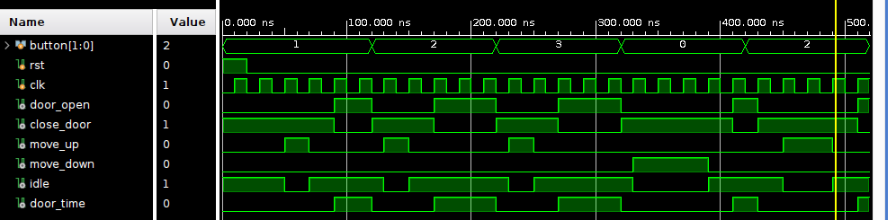

#elevator_controller (verilog FSM)

##OVERVIEW:
       Designed and implemented a Finite State Machine (FSM)-based elevator controller in Verilog, supporting multi-floor navigation and door control; verified functionality through simulation and waveform analysis.

##FEATURES:
       Supports multiple floor requests (2-bit input i.e 4 floors)
       Handles:
            Moving up,
            Moving down,
            Door opening, 
            Door closing,
            Idle state 

       Fully synchronous design using clock (clk).
       Reset functionality (rst).
      
##FSM States:
IDLE: Elevator is stationary 
MOVE_UP:Elevator moving up
MOVE_DOWN:Elevator moving down
DOOR_OPEN:Door is open
CLOSE_DOOR:Door is closing

##Inputs and Outputs
🔹 Inputs
input [1:0] button;  // Target floor
input clk;           // Clock signal
input rst;           // Reset signal
🔹 Outputs
output reg door_open;
output reg close_door;
output reg move_up;
output reg move_down;
output reg idle;

##Design Description

The system works in three main blocks:
1️⃣ State Register
Updates current state on every clock edge
Handles reset condition
2️⃣ Next-State Logic
Decides next state based on:
Current state
Requested floor (button)
Current floor
3️⃣ Output Logic
Controls elevator signals based on state
🔄 State Transitions
IDLE → CLOSE_DOOR when request is different.
CLOSE_DOOR → MOVE_UP / MOVE_DOWN.
MOVE_UP / MOVE_DOWN → IDLE when destination reached.
IDLE → DOOR_OPEN if already at requested floor.

##Testbench:

A testbench (elevator_controller_tb) is included to simulate:
Test Sequence:
1.Reset system
2.Request floor 1
3.Request floor 2
4.Request floor 3
5.Return to floor 0
6.Request floor 2

##Expected Behavior:
Elevator moves step-by-step between floors.
Opens door upon reaching target floor.
waits for few seconds.
Chooses direction automatically.
Returns to idle when no movement needed.

##Known Issues / Fixes:
Ensure correct use of:
Issue 1:<= in sequential logic
Fix 1:= in combinational logic
2.Avoid updating registers in combinational blocks
3.Add default assignments to prevent latches
4.Ensure proper state transition timing

##Simulation:
Run simulation using tools like:
Xilinx Vivado
###Steps:
Compile design
Run behavioral simulation
Observe waveform:
current_floor
state
control signals

##Future Improvements:

Add request queue (multiple floor handling).
Add floor display output.
Implement priority scheduling.
Add emergency stop feature.

##WaveForm

